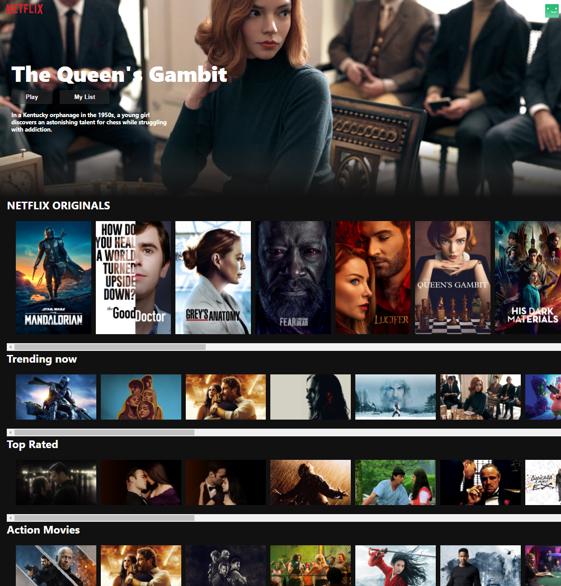

</a>

<!-- [](http://fvcproductions.com) -->

# Netclix-Clone v1

> React.js

> html5,css

> firebase deployment

> website link <a href="https://netflix-clone-2c6c0.web.app/" target="_blank">`https://netflix-clone-2c6c0.web.app/`</a>

**_Project peak _**

[]()

- This application (a Netflix clone) was built using React (Custom Hooks, Context), Firebase & Styled Components. I have built the following pages within this application: browse & lastly the homepage.
- I used compound components (just a design pattern) to build my components, and there's over 10 examples as to how these are used. The styling is all handled via styled components. Using compound components made my actual dumb components really easy to test.
- Used firbase to deploy and github for latest version update
- Used TMDB API to get up to date movie from nextflix

> GIF Tools

- Used <a href="http://recordit.co/" target="_blank">**Recordit**</a> to create quicks screencasts of your desktop and export them as `GIF`s.

**netflix-clone quick view**


---

## Table of Contents (Optional)

> If your `README` has a lot of info, section headers might be nice.

- [Installation](#installation)
- [Features](#features)
- [Contributing](#contributing)
- [Team](#team)
- [FAQ](#faq)
- [Support](#support)
- [License](#license)

---

## Installation

- With a few lib set up we can start!!

### Clone

- Clone this repo to your local machine using `https://github.com/charlesZ-byte/netflix-clonev1.git`

### Setup

- If you want more syntax highlighting, format your code like this:

> update and install this package first

```shell
$ brew update
```

> now install npm and bower packages

```shell
$ npm install
$ bower installpip install torch torchvision
```

> Use npm command we are good to go

```shell
$ npm start
```

- For all the possible languages that support syntax highlithing on GitHub (which is basically all of them), refer <a href="https://github.com/github/linguist/blob/master/lib/linguist/languages.yml" target="_blank">here</a>.

---

## Features

- Have Ease-in and out animation Navigation bar
- Hover movie pictures
- API get trailer for each movie and display it
- All movie up to date compare to netflix

---

## Contributing

> To get started...

### Step 1

- **Option 1**

  - 🍴 Fork this repo!

- **Option 2**
  - 👯 Clone this repo to your local machine using `https://github.com/joanaz/HireDot2.git`

### Step 2

- **HACK AWAY!** 🔨🔨🔨

### Step 3

- 🔃 Create a new pull request using <a href="https://github.com/joanaz/HireDot2/compare/" target="_blank">`https://github.com/joanaz/HireDot2/compare/`</a>.

---

## FAQ

- **How do check this webapplication?**
  - It is easy, go to top and click the webapplication link

---

## Support

Reach out to me at one of the following places!

- Website at <a href="http://www.charleszhang0502.com" target="_blank">`www.charleszhang0502.com`</a>
- LinkedIn at <a href="www.linkedin.com/in/shuming-zhang52" target="_blank">`www.linkedin.com/in/shuming-zhang52`</a>

---

## License

[](http://badges.mit-license.org)

- **[MIT license](http://opensource.org/licenses/mit-license.php)**
- Copyright 2015 © <a href="http://fvcproductions.com" target="_blank">FVCproductions</a>.
